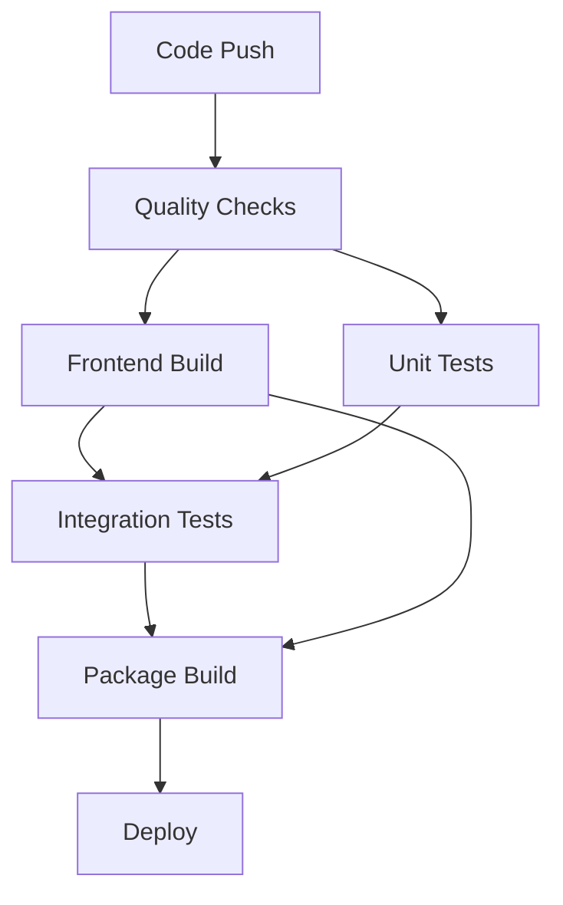

# Build System Integration for Phase 3 Frontend Modularization

## Overview

The Phase 3 frontend modularization now includes full build system integration across Docker, Makefile, and CI/CD pipeline. This ensures the new modular frontend is properly built and deployed in all environments.

## Build Integration Components

### 1. Makefile Frontend Targets

```bash
# Install frontend dependencies
make frontend-install

# Build frontend assets for production
make frontend-build

# Start development server with hot reload
make frontend-dev

# Watch files for changes during development
make frontend-watch

# Clean build artifacts
make frontend-clean

# Lint frontend code
make frontend-lint

# Format frontend code
make frontend-format
```

### 2. Docker Integration

#### Updated Dockerfile (`docker/Dockerfile.web`)
- **Node.js Installation**: Added Node.js 20.x to base image
- **Frontend Dependencies**: `npm ci` for production builds
- **Asset Building**: `npm run build` in both development and production stages
- **Layer Caching**: Package files copied before source for better caching

#### Build Process
```bash
# Build with frontend assets included
make build

# Or directly with Docker Compose
docker compose build
```

### 3. CI/CD Pipeline Integration

#### New GitHub Actions Jobs

**Frontend Quality Checks** (in `quality` job):
- Node.js 20 setup with npm caching
- Frontend dependency installation
- ESLint code linting
- Prettier format checking

**Frontend Build Job**:
- Dedicated frontend asset building
- Build artifact upload
- Integration with Python build process

**Updated Dependencies**:
- `build` job now depends on `frontend` completion
- `deploy` and `notify` jobs include frontend status
- Frontend assets included in package artifacts

### 4. Vite Configuration Updates

#### Build Targets
```javascript
// Core modular components
'app': 'src/hwautomation/web/frontend/js/core/app.js'
'module-loader': 'src/hwautomation/web/frontend/js/core/module-loader.js'

// Services layer
'services/api': 'src/hwautomation/web/frontend/js/services/api.js'
'services/state': 'src/hwautomation/web/frontend/js/services/state.js'
'services/notifications': 'src/hwautomation/web/frontend/js/services/notifications.js'

// UI Components
'components/theme-manager': 'src/hwautomation/web/frontend/js/components/theme-manager.js'
'components/connection-status': 'src/hwautomation/web/frontend/js/components/connection-status.js'
'components/device-selection': 'src/hwautomation/web/frontend/js/components/device-selection.js'

// Utilities
'utils/dom': 'src/hwautomation/web/frontend/js/utils/dom.js'
'utils/format': 'src/hwautomation/web/frontend/js/utils/format.js'

// CSS bundle
'main': 'src/hwautomation/web/frontend/css/main.css'
```

#### Output Structure
```
src/hwautomation/web/static/dist/
├── js/
│   ├── app.[hash].js
│   ├── module-loader.[hash].js
│   ├── services/
│   │   ├── api.[hash].js
│   │   ├── state.[hash].js
│   │   └── notifications.[hash].js
│   ├── components/
│   │   ├── theme-manager.[hash].js
│   │   ├── connection-status.[hash].js
│   │   └── device-selection.[hash].js
│   └── utils/
│       ├── dom.[hash].js
│       └── format.[hash].js
├── css/
│   └── main.[hash].css
└── manifest.json
```

## Development Workflow

### Local Development

1. **Setup Environment**:
   ```bash
   make dev-setup  # Now includes npm install
   ```

2. **Start Development**:
   ```bash
   # Terminal 1: Frontend development server
   make frontend-dev

   # Terminal 2: Flask application
   make up
   ```

3. **Watch Mode** (alternative):
   ```bash
   # Build assets on file changes
   make frontend-watch
   ```

### Code Quality

```bash
# Check formatting and linting
make frontend-lint
npm run format:check

# Fix issues
make frontend-format
npm run lint:fix
```

### Production Build

```bash
# Full production build
make build

# Or step by step
make frontend-build  # Build assets
make build          # Build Docker images
```

## Deployment Integration

### Container Build Process

1. **Base Image**: Python 3.11 + Node.js 20
2. **Dependencies**:
   - Python packages via pip
   - Frontend packages via npm
3. **Asset Building**:
   - Frontend assets built during image creation
   - Optimized for production (minified, compressed)
4. **Runtime**:
   - Only built assets included
   - No build tools in final image

### CI/CD Pipeline Flow



### Environment Variables

```bash
# Development
NODE_ENV=development
VITE_DEV_SERVER=true

# Production
NODE_ENV=production
VITE_BUILD_TARGET=production
```

## Migration and Compatibility

### Backward Compatibility
- Legacy asset paths still supported
- Existing JavaScript continues to work
- Gradual migration path available

### Template Integration
```html
<!-- Modern modular approach -->
<script type="module" src="{{ url_for('static', filename='dist/js/app.js') }}"></script>
<link rel="stylesheet" href="{{ url_for('static', filename='dist/css/main.css') }}">

<!-- Legacy support -->
<script src="{{ url_for('static', filename='js/app.js') }}"></script>
```

### Performance Benefits
- **Code Splitting**: Components loaded on demand
- **Tree Shaking**: Unused code eliminated
- **Compression**: Assets minified and gzipped
- **Caching**: Hash-based cache busting

## Monitoring and Debugging

### Build Monitoring
- CI pipeline reports build status
- Build artifacts uploaded for inspection
- Source maps generated for debugging

### Development Tools
- Vite dev server with hot reload
- Source maps for debugging
- Error reporting and stack traces

### Production Monitoring
- Asset loading performance metrics
- Module loading success/failure tracking
- Progressive enhancement fallbacks

## Future Enhancements

### Planned Improvements
1. **Bundle Analysis**: Webpack bundle analyzer integration
2. **Progressive Loading**: Lazy loading for large components
3. **Service Worker**: Offline functionality and caching
4. **Testing**: Jest integration for frontend unit tests
5. **Storybook**: Component documentation and testing

### Scaling Considerations
- **Micro-frontends**: Component isolation for team scaling
- **CDN Integration**: Asset delivery optimization
- **Build Optimization**: Parallel builds and caching strategies

This integrated build system ensures that the Phase 3 modular frontend architecture is properly supported across all development, testing, and deployment environments.
